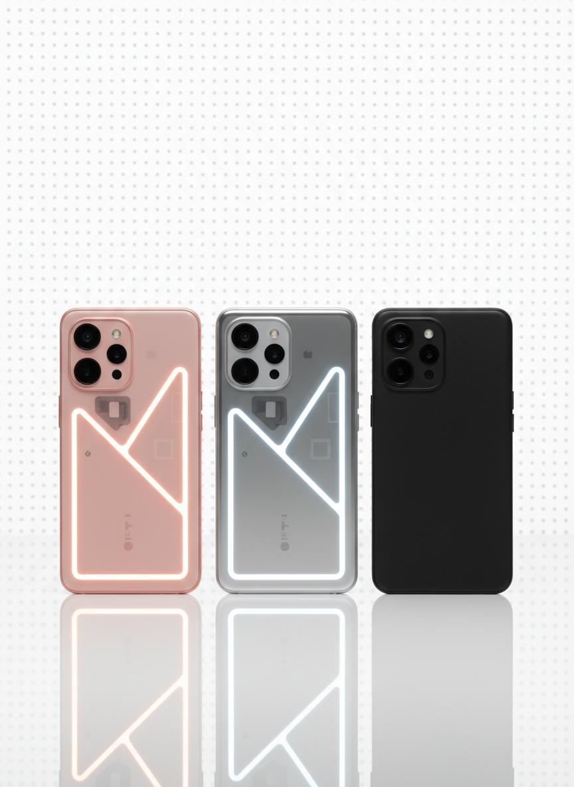

# Nothing.tech Website Clone

A pixel-perfect clone of the Nothing.tech website featuring premium tech product showcases with elegant animations and a minimalist design aesthetic.



## Features

- **Responsive Design**: Works on desktop, tablet, and mobile devices
- **Smooth Animations**: Scroll-based parallax effects and micro-interactions
- **Product Showcase**: Multiple sections for different Nothing products
- **Full-Screen Menu**: Elegant navigation overlay with stagger animations
- **Support Page**: Complete support center with FAQs and help categories
- **Modern Stack**: Built with React, TypeScript, Tailwind CSS, and Framer Motion

## Tech Stack

- **Framework**: React 18 + TypeScript
- **Build Tool**: Vite
- **Styling**: Tailwind CSS 3.4
- **UI Components**: shadcn/ui
- **Animations**: Framer Motion
- **Icons**: Lucide React
- **Fonts**: Space Grotesk, Space Mono, Inter

## Project Structure

```
my-app/
├── src/
│   ├── components/
│   │   ├── layout/          # Navbar, Footer, Menu
│   │   ├── sections/        # Hero, Product sections
│   │   └── shared/          # Reusable components
│   ├── pages/               # Home, Support pages
│   ├── lib/                 # Utilities and animations
│   ├── types/               # TypeScript types
│   └── App.tsx              # Main app component
├── public/images/           # Product images
└── dist/                    # Build output
```

## Getting Started

### Prerequisites
- Node.js 18+ 
- npm or yarn

### Installation

```bash
# Clone the repository
git clone https://github.com/YOUR_USERNAME/nothing-tech-website.git

# Navigate to project folder
cd nothing-tech-website

# Install dependencies
npm install

# Start development server
npm run dev
```

The development server will start at `http://localhost:5173`

### Build for Production

```bash
npm run build
```

The built files will be in the `dist` folder.

## Sections Included

1. **Hero Section** - Phone (4a) Pro showcase with floating product card
2. **Phone 4a Collection** - Multiple color variants display
3. **Phone 3a Section** - Dark background with transparent phone design
4. **Headphones Section** - Floating animation with product showcase
5. **Phone 3a Lite Section** - Angled phone display
6. **Footer** - Full navigation with dotted grid background
7. **Support Page** - Complete support center with FAQs

## Design Highlights

- **Dotted Grid Pattern**: Signature Nothing aesthetic background
- **Glassmorphism Cards**: Frosted glass effect on product cards
- **Scroll Parallax**: Smooth scroll-linked animations
- **Pixel Typography**: Dot-matrix style text for navigation
- **Minimalist UI**: Clean, distraction-free product focus

## Customization

### Changing Product Images
Replace images in `public/images/` folder:
- `hero-phones.jpg` - Hero section main image
- `phones-collection.jpg` - Phone 4a collection
- `phone-3a.jpg` - Phone 3a transparent design
- `headphones.jpg` - Headphones product shot
- `phones-floating.jpg` - Phone 3a Lite display
- `phone-black.jpg` - Thumbnail image

### Modifying Colors
Edit `tailwind.config.js`:
```javascript
colors: {
  nothing: {
    black: '#000000',
    white: '#FFFFFF',
    gray: '#666666',
    accent: '#FF0000',
  },
}
```

### Animation Timing
Edit `src/lib/animations.ts`:
```typescript
export const ANIMATION_CONFIG = {
  duration: {
    fast: 0.3,
    normal: 0.5,
    slow: 0.8,
  },
}
```

## Deployment

### GitHub Pages
1. Build the project: `npm run build`
2. Push the `dist` folder to GitHub
3. Enable GitHub Pages in repository settings
4. Your site will be live at `https://YOUR_USERNAME.github.io/nothing-tech-website`

### Netlify/Vercel
1. Connect your GitHub repository
2. Build command: `npm run build`
3. Publish directory: `dist`

## Credits

- Original design by [Nothing](https://nothing.tech)
- Built as a learning project
- Product images generated with AI

## License

This project is for educational purposes only. All product designs and trademarks belong to Nothing Technology Limited.
